# pfsense-ultimate-config
This project contains the documentation on how to setup your pfSense firewall to route traffic through VPN providers and provide corporate features not found in home networks

## Table of Contents
1. [Features](#features)
2. [Requirements](#requirements)
3. [Before We Start](#before-we-start)
    1. [VPN Provider Information Gathering](#vpn-provider-information-gathering)
4. [Prepare the Virtual Environment](#prepare-the-virtual-environment)
5. [Install Virtual pfSense](#install-virtual-pfsense)
6. [Install Virtual Debian](#install-virtual-debian)
7. [Initial pfSense Setup](#initial-pfsense-setup)
8. [Make Initial pfSense Snapshot](#make-initial-pfsense-snapshot)
9. [Install pfSense 3rd Party Packages](#install-pfsense-3rd-party-packages)
10. [Create CA and Certificates](#create-ca-and-certificates)
11. [OpenVPN Tunnels](#openvpn-tunnels)
12. [Service Watchdog](#service-watchdog)
13. [WireGuard Tunnel](#wireguard-tunnel)
14. [Redirecting all WAN bound traffic through VPNs](#redirecting-all-wan-bound-traffic-through-vpns)
    1. [Create VPN Interfaces](#create-vpn-interfaces)
    2. [Create Gateway For WireGuard](#create-gateway-for-wireguard)
    3. [Test VPN Connectivity](#test-vpn-connectivity)
    4. [Create Gateway Group](#create-gateway-group)
    5. [Update NAT Settings](#update-nat-settings)
    6. [Update Firewall Rules](#update-firewall-rules)
    7. [Setup Load Balancing](#setup-load-balancing)
    8. [Verify Default WAN Behavior](#verify-default-wan-behavior)
    9. [Setup DNS and SSL/TLS Outgoing DNS Queries](#setup-dns-and-ssltls-outgoing-dns-queries)
    10. [Section Conclusion](#section-conclusion)
15. [Setup Bypass Proxy](#setup-bypass-proxy)
16. [Setup Static DHCP Entries to Force Gateways Per Host](#setup-static-dhcp-entries-to-force-gateways-per-host)
17. [Dial-in VPN Support](#dial-in-vpn-support)
18. [Import to Production Environment](#import-to-production-environment)

## Features
* Secure VPN:
   * VPN aggregation with WAN fail over. ✓
   * OpenVPN with hardware acceleration. ✓
   * Wireguard with hardware acceleration. ✓
   * Details on how to connect to ExpressVPN and NordVPN. ✓
   * Load Balancing. ✓
   * Dedicated connections for media devices to bypass VPN. ✓
   * VPN Passthrough for IKE/IPSEC/OpenVPN. ✓
   * Dial-in VPN Support ✓
   * DNS over SSL/TLS ✓
* Squid Proxy for sites that do no like VPNs:
   * Includes instructions to setup a CA for HTTPS. ✓
   * Includes wpad.dat / wpad.da / proxy.pac configuration via DHCP. ✓
* Custom DHCP options:
   * PXE.
   * Custom NFSroot options for NFSv3/v4.1.
   * Automatic proxy configuration. ✓
* Whitebox instructions for pcengines.ch devices:
   * Firmware Updates.
   * Performance Improvements.
* Containerized PXE boot with netboot.xyz:
   * Includes how to customize Windows PE to chainload Win10 and Win11 installs.
   * Includes how to create dynamic NFS root configurations via pfSense that iPXE reads from DHCP information.
   * Includes how to create custom dynamic netboot.xyz menus for iPXE.
* Network Analysis via Traffic Totals.
* TODO:
   * Containerized Network Analysis Reports.
   * Add drivers to WinPE for additional network card support.

## Requirements
* Hardware:
    * whitebox or netgate (not the cheapest!) network appliance
        * I recommend pcengines apu2/3, personally I use an apu2c4 board.
        * If using an old desktop, a second 1gbe nic and labeling the MAC address on the outside so you know which NIC is which later.
* Software:
    * VirtualBox -- https://www.virtualbox.org/wiki/Downloads
    * Docker on a NAS or server, personally I use Synology with DSM 7.1 which already supports Docker as an add-on package.
    * pfSense -- https://www.pfsense.org/download/ -- AMD64 -- ISO
    * A couple LiveCDs -- I use Debian during the setup as WireGuard is _not_ possible to setup in Gentoo quickly.
        * https://www.gentoo.org/downloads/ -- Click on "LiveGUI USB Image"
        * http://debian.osuosl.org/debian-cdimage/11.6.0-live/amd64/iso-hybrid/debian-live-11.6.0-amd64-kde.iso
* Knowledge:
  * A general working understanding of IPV4, protocols and SSL. However, I will do my best to remove the mystery for the otherwise uninitiated.

## Before We Start
The process is to build up a virtual environment using your new configuration we build together so you don't break your internet connection unintentionally. You can use VMware Fusion/Workstation/ESXi or Microsoft HyperV, but I'm going with an open source platform agnostic solution here.<br><br>
I will need you to find a few things before we start.
1. Figure out your internet provider's WAN configuration. If you don't know, it is probably DHCP. Find the WAN MAC Address of your current router and write it down!<br>
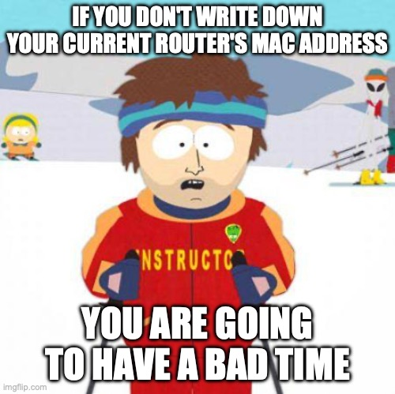
2. Be prepared for configuration corruption and using snapshots of your pfSense install as you tinker with it. Once we create a configuration you are happy with we can export it and apply it to your production environment.
3. Also be prepared that your current VPN provider might suck. You will want to research what VPN providers in your area you want to use, as well as seeing how flexible they are at sending a ton of data through their network.
4. Lastly, VirtualBox is not great with keeping the network up between virtual machines, you may have to reboot both of them time to time in order to reestablish connections.

### VPN Provider Information Gathering
#### ExpressVPN
* Their directions: https://www.expressvpn.com/support/vpn-setup/pfsense-with-expressvpn-openvpn/
    * In my experience, I highly doubt most vpn providers actually try to keep these settings for pfSense updated, familiarize yourself with what they recommend then come back to this page and apply the information they provided with what I know to work.
    * ExpressVPN allows for 2 concurrent connections via OpenVPN (Yes, they say 5 devices, but we're connecting the SAME device twice!), they do not currently allow for WireGuard connections (2023-04-07) as they deem it experimental and not secure yet.
    * You will want the following information from your account page with them:
        * Username / Password
        * TLS OpenVPN Static Key -- in case the one published here is out of date (2023-04-07)
        * Encryption Algorithm -- in case the one published here is out of date (2023-04-07)

#### NordVPN
* Their directions: https://support.nordvpn.com/Connectivity/Router/1626958942/pfSense-2-5-Setup-with-NordVPN.htm
* NordVPN has directions for both OpenVPN and WireGuard. I will be using WireGuard in this guide for the final product but will provide my last used settings for OpenVPN. If you know how to improve upon them, let me know!
* NordVPN also allows for 2 concurrent connections via OpenVPN, but only just 1 using WireGuard, however the throughput will be a lot higher per connection via WireGuard.
* Setting up WireGuard will require a lot of additional steps to lift the information specific for your connection, we will circle back to this topic after we have Debian running.

## Prepare the Virtual Environment
1. Download your LiveCD and pfSense .iso files.
2. Install VirtualBox.
3. Unpack the pfsense.iso.gz file, I run a mac and the default archiver will not unpack it, use keke or the following command:
    *   ```gzip --decompress pfSense-CE-2.6.0-RELEASE-amd64.iso.gz```
4. Open VirtualBox.
5. Create a new Virtual Machine for pfSense. I emulate the settings of pcengines.ch APU2c4.
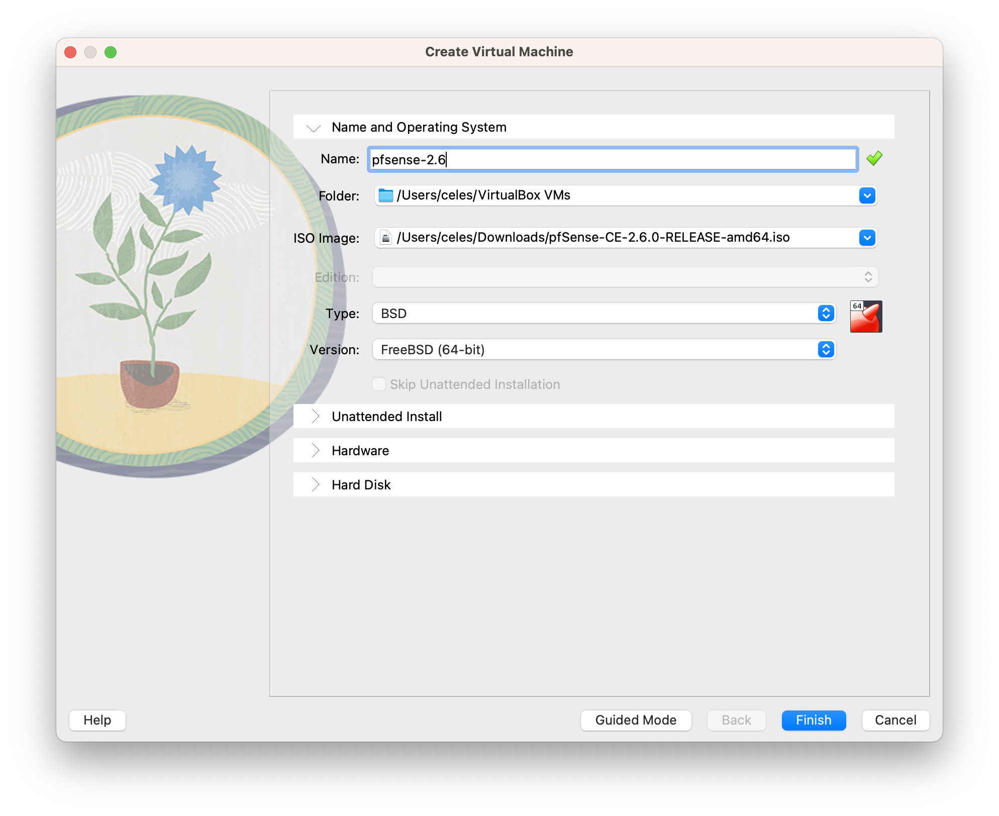
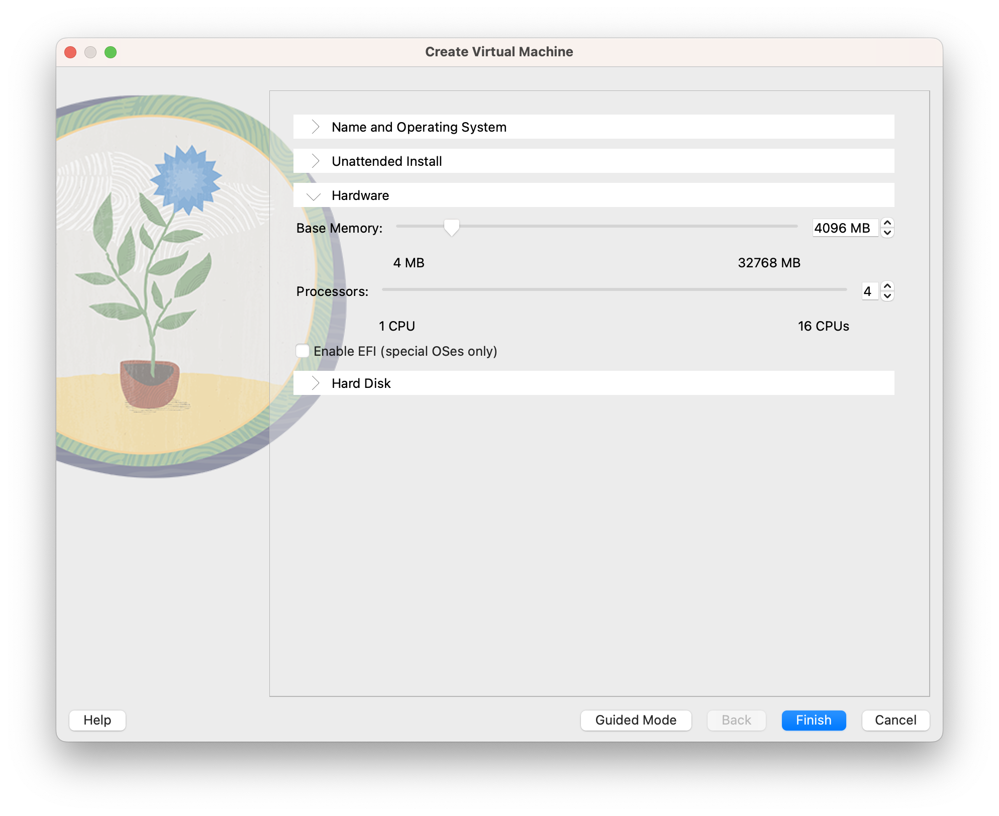
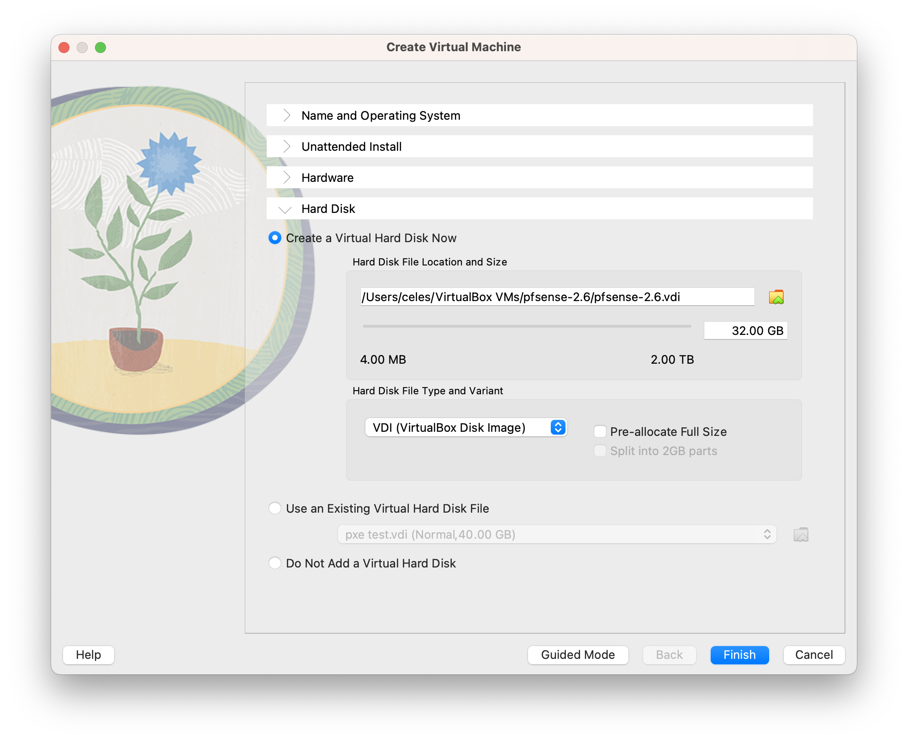
    1. Once created, right click on virtual machine and add it to a group so you do not get it confused with your other virtual machines!
    2. Select the virtual machine we just created and click **Settings > Network > Adapter 1**.
    3. Change the attached network to **Bridged Adapter**.
    4. Select the ethernet port that your computer is currently using to connect to your network.
    5. Click **Adapter 2 > Enable Network Adapter**.
    6. Change the attached network to **Internal Network**.
    7. Change the name to **pfSense**.
    8. You should be left with settings like these:
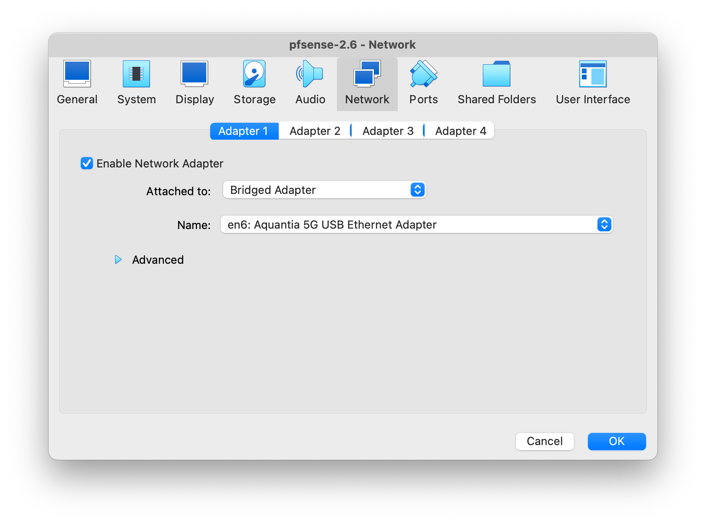
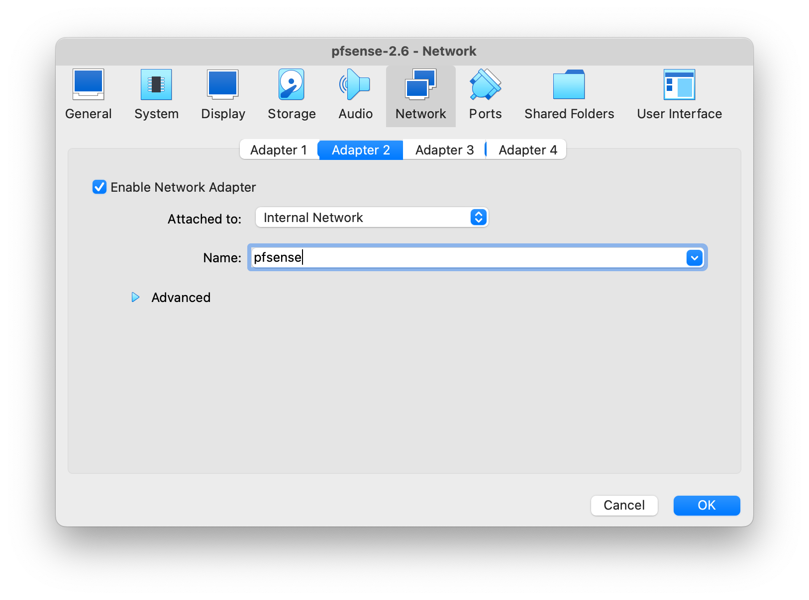
    9. Make note of the MAC addresses used by virtualbox otherwise you will not know which is which when setting up pfSense.
    10. Once updated, we will create the second virtual machine.
6. Create a new Virtual Machine for the Debian LiveCD, give it enough power that you don't 5 minutes waiting for it to boot, you're not using all those extra cores anyway [=:
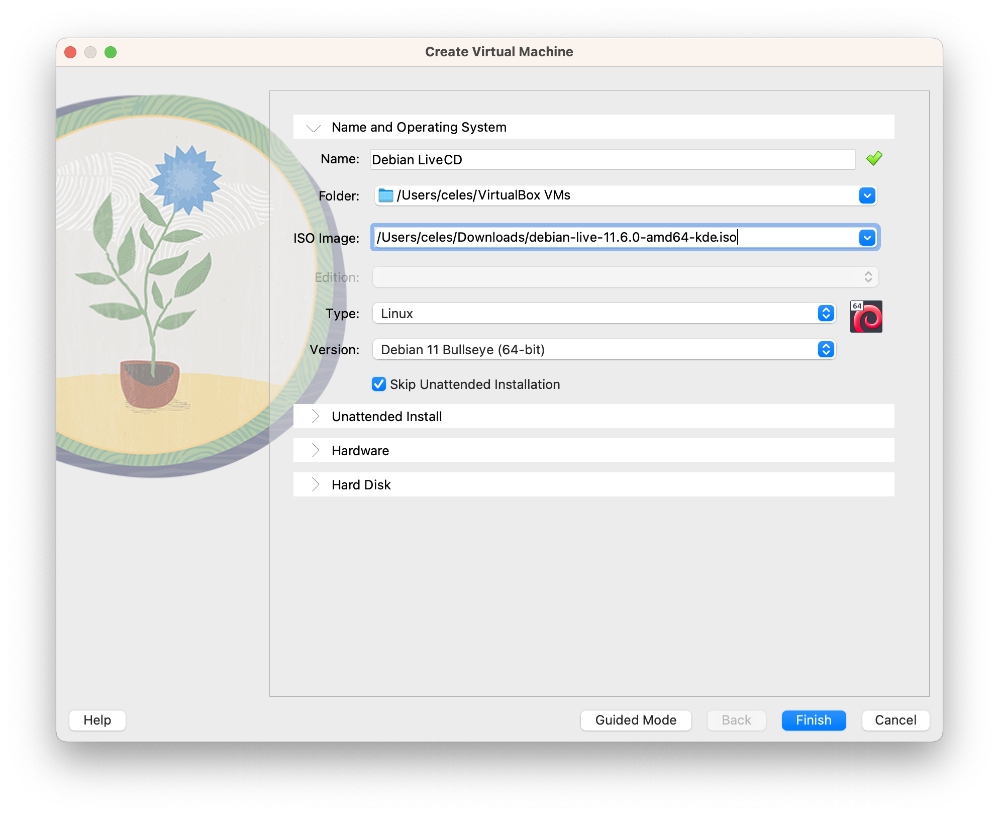
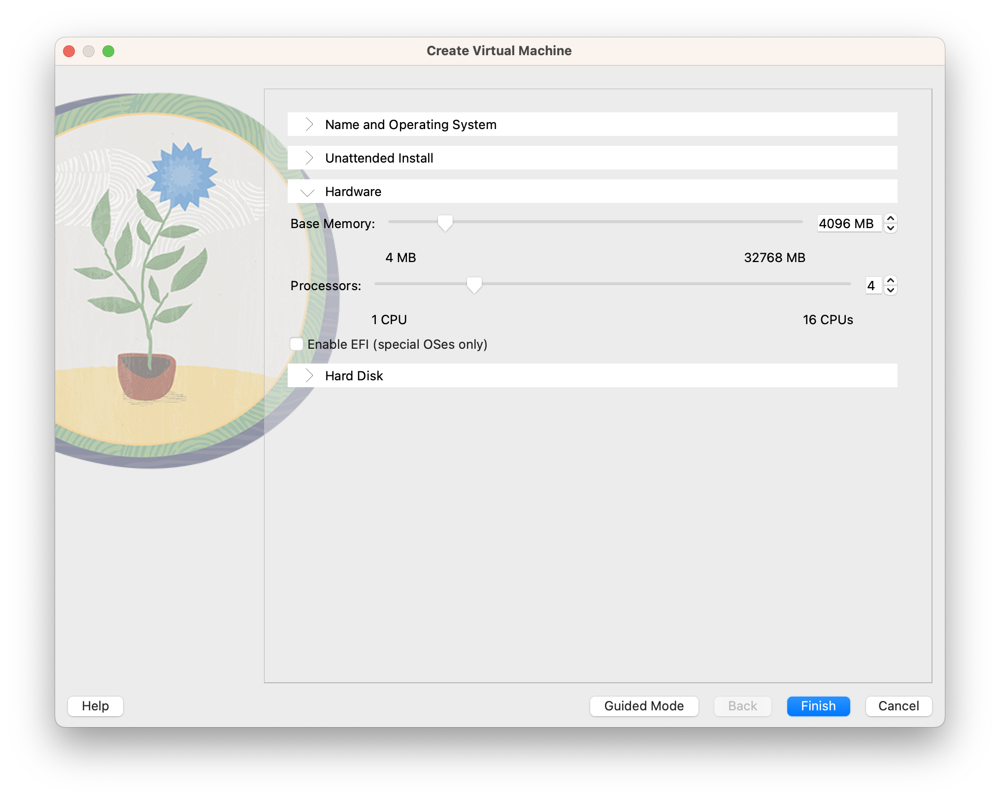
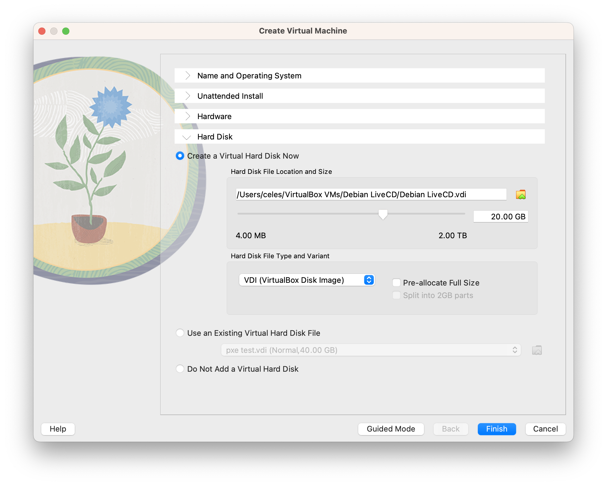
    1. Select the virtual machine we just created and click **Settings > Network > Adapter 1**.
    2. Change the attached network to **Internal Network**.
    3. Change the name to **pfSense**.
    4. Click **General > Advanced**
    5. Update **Shared Clipboard** to **Bidirectional**
    6. Save changes.

## Install Virtual pfSense
1. Start the pfsense virtual machine.
    * If you have a Retina display click **View > Virtual Screen 1 > Scale to 200%**.
2. Mash enter through the entire install.
3. Reboot the virtual machine.
    1. It will start the iso again, select from the menu above **Machine > ACPI Shutdown**.
    2. Open settings and navigate **Storage** then the CD icon under Storage Devices, on the right side of the menu click the CD icon again and select **Remove Disk from Virtual Drive**
    3. Restart the virtual machine.
    4. You shouldn't need luck yet to see this screen, if you do, quit now:<br>
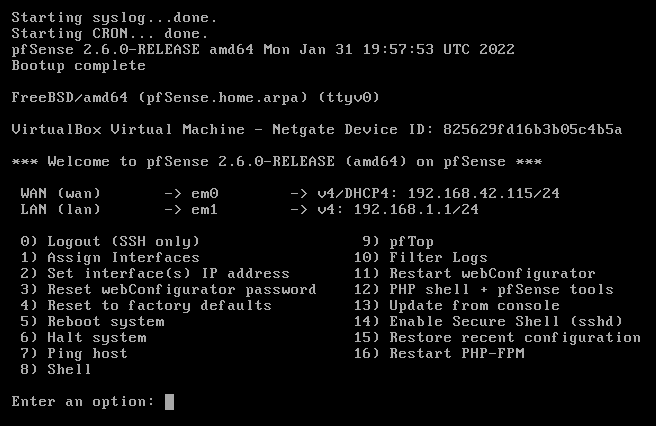
    5. We configured the interfaces in the right order so we do not need to do anything here, however, when you build the actual device, you may have to reassign the interfaces.
    6. You may need to change the LAN network if your **WAN** also lists **192.168.1.x/24** to do that, select option **2** and follow the onscreen directions. Or if you can wait, the general setup wizard below will do it for you.

## Install Virtual Debian
1. We now leave the pfSense virtual machine on at all times and use the Debian LiveCD to edit and test the new configuration!
    * If I do not specify otherwise or if you know better, everything in the following steps is left as **Default**.
2. Start the Debian LiveCD.
    * If you have a Retina display click **View > Virtual Screen 1 > Scale to 200%**.
3. Click on **Install Debian**
4. Follow the instructions on the screen to install, it is mostly a _mash next_ endeavor.<br>
&nbsp;&nbsp;&nbsp;&nbsp;&nbsp;&nbsp;&nbsp;
    * <span style="color:red">I suggest setting the correct timezone so you don't get SSL errors later!</span><br>

    * * If your screen locks while it installs, the password is **live**
5. Shut the virtual machine down. VirtualBox will automagically remove the LiveCD for you after installation.
6. Start the Debian virtual machine back up again and login.
7. Open **Konsole** and run the following commands:
    1. ```sudo su```
    2. ```apt-get update && apt-get upgrade```
    3. ```apt-get install dkms linux-headers-$(uname -r) build-essential```
    4. ```exit```
8. On the menu above the virtual machine, click **Devices > Insert Guest Additions CD Image**
9. Open the directory of the mounted cd image
10. Double click on **autorun.sh**
11. Once complete, reboot the Debian virtual machine
12. Click on the menubar for the virtual machine and adjust the scale manually to what is typically comfortable. At this point it will wake up and give you the full resolution.
13. Depending on your VPN providers, installation instructions may vary. Below are the steps outlined to get ExpressVPN and NordVPN settings for pfSense.
    1. Open Firefox.
    2. Navigate to: https://www.expressvpn.com/setup#manual -- You will have to login.
    3. Find some servers near you from the expandable list on the right and download their *.ovpn files.
    4. Now we get NordVPN
    5. Go back to **Konsole** and install it with: ```sh <(curl -sSf https://downloads.nordcdn.com/apps/linux/install.sh)```
    6. ```sudo usermod -aG nordvpn $USER```
    7. ```sudo apt-get install wireguard```
    8. Reboot the Debian virtual machine and open the terminal again.<br>
&nbsp;&nbsp;&nbsp;&nbsp;&nbsp;&nbsp;&nbsp;
        * <span style="color:red">Do not skip this step as NordVPN has its own implementation of WireGuard that it will use if it cannot connect the running WireGuard system socket</span><br>

    9. Navigate to: https://www.nordvpn.com -- You will have to login.
    10. Click **NordVPN** under **Services** on the left navigation bar.
    11. Scroll down until you see **Access token**
    12. Generate a new token for 30 days.
    13. Paste into Konsole as ```nordvpn login --token <copied tokenID without the alligator brackets>```
        * <span style="color:yellow">**Watch out for garbage at the beginning and end of the copied string, it doesn't paste cleanly!**</span>
    14. ```nordvpn connect```
    15. ```sudo wg show```
    16. ```sudo wg showconf nordlynx```
    17. Save this information from all 3 commands as you will need it later! I saved mine with my favorite text editor which wasn't installed:
        * ```sudo apt-get install vim```
    18. ```nordvpn disconnect```
14. You will want to setup shared folders to export your new configuration for when you migrate to your production environment or to make life easier with other tasks
    1. In virtualbox, navigate to: **Debian LiveCD > Settings > Shared Folders**
    2. Map a folder to /mnt/shared

## Initial pfSense Setup
1. Open an installed browser **Firefox/Chromium/Konqueror** and Navigate to:192.168.1.1 (unless you had to change it above, however, I will be referring to it as 192.168.1.1 for the rest of this section).
2. Login to pfSense using the default login credentials: **admin / pfsense**
3. Follow the general setup instructions and make changes on steps I highlight below:
    1. **Step 2**: Setup the hostname and search domain of your firewall, for this I use **pfSense** and **virtualhome.local**:<br>
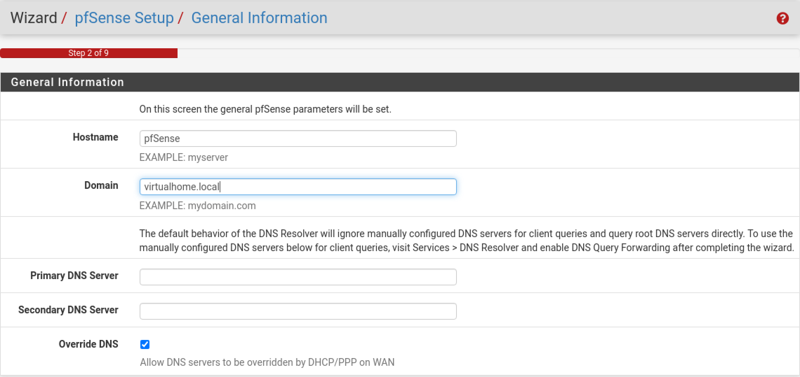
    2. **Step 3**: NTP settings are safe to leave alone unless you have your own:
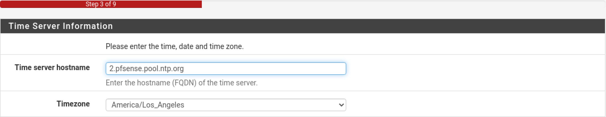
    3. **Step 4**: This is where you should enter your current router's MAC address. Do it right now!
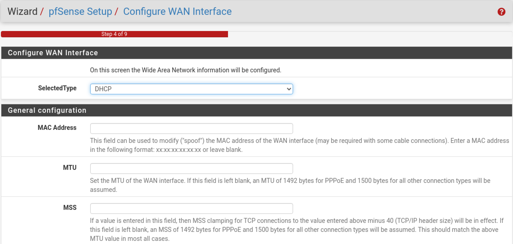
    4. **Step 5**: This is where you can change your local network from 192.168.1.1, we will be setting it to 192.168.5.1/24 for this virtual environment:<br>
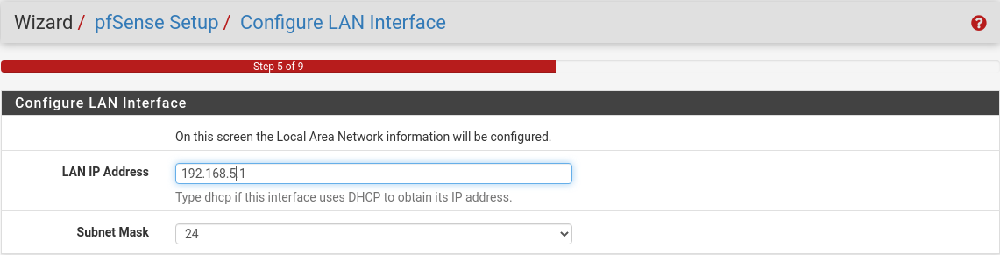
    5. pfSense will now attempt to reload the page and fail. Disconnect and connect **Wired connection 1** from the task manager in the bottom right. Then Navigate to:**192.168.5.1**:<br>
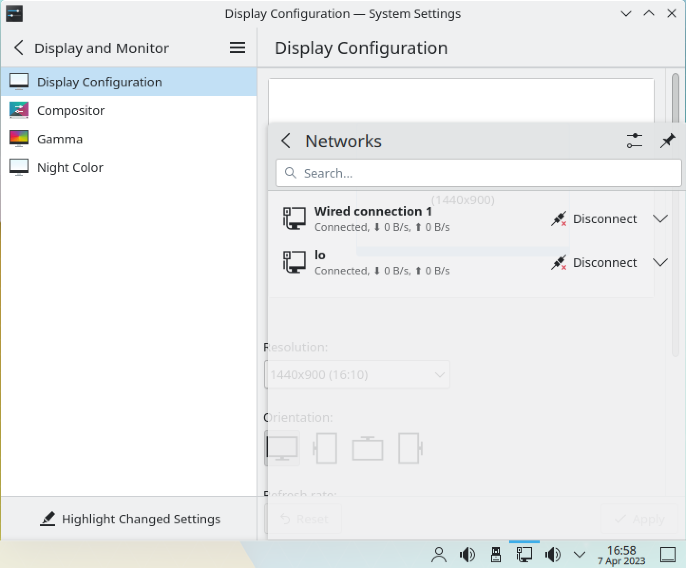
    6. At this point, the internet will start working through the Firewall in the Debian virtual machine. And it finished the general setup while the network was broken.

## Make Initial pfSense Snapshot
1. You will be making a lot of mistakes, the pfSense configuration can get 'stuck' or messed up from aggressive tinkering as of version 2.4.x. As an extra precaution, I like to create snapshots in stages in order to not have to chase a _Ghost in the Shell_. 
2. We are going to make one change to the config before we make a Snapshot.
3. Click **System > Advanced**. Change the **Protocol** to **HTTP** then click **Save**
    * Why? The wpad.dat / wpad.da / proxy.pac file will be stored on the Firewall and will be called by browsers on your network. If this is a concern, host them elsewhere, you can point to them later via DHCP options. Otherwise, you will need self-signed certs everywhere.
4. pfSense will get angry again, use the pfSense virtual machine terminal to reboot it (Yeah, I don't remember pfSense having these problems either).
5. Try logging into pfSense from your Gentoo virtual machine again. It should be working again. Once confirmed, use the next step to create the snapshot.
6. Open the pfSense virtual machine window. Click **Machine > Take Snapshot**, Label it, **Initial Config**
7. Once created, shut down pfSense and then restore the snapshot top verify it actually works. Snapshots are hidden in the menu just right of the virtual machine name:<br>
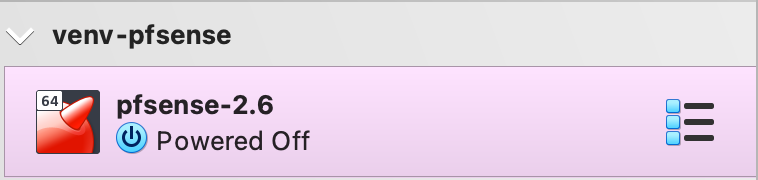

## Install pfSense 3rd Party Packages
1. Navigate to:**System > Package Manger > Available Packages**
2. Install the following packages:
    * Filer
    * nmap
    * pfBlockerNG
    * Service_Watchdog
    * squid
    * Status_Traffic_Totals
    * WireGuard
3. Take another snapshot and label it: **Installed Packages**

## Create CA and Certificates
* <span style="color:red">**From this point forward in the documentation, if I omit details about configuring something, it means I leave it at its default values.**</span>
1. Navigate to:**System > Certificate Manager > Add**
2. Enter the following data:
    * **Descriptive name:** Home CA
    * **Method:** Create an internal Certificate Authority
    * **Randomize Serial:** Checked
    * **Common Name:** internal-vpn-ca
    * Fill out the rest of the information as needed.
    * Save
3. Add
4. Enter the following data:
    * **Descriptive name:** ExpressVPN CA
    * **Method:** Import an existing Certificate Authority
    * **Certificate data:** 
      * Open one of the ExpressVPN .ovpn files and copy everything inbetween **\<ca\>** and **\</ca\>** and paste it into this text box.
    * Save
5. <br><span style="color:green">**Optional**, add the NordVPN CA certificate for OpenVPN -- Click **Add**</span>
6. <span style="color:green">Enter the following data:</span>
    * <span style="color:green">**Descriptive name:** NordVPN CA</span>
    * <span style="color:green">**Method:** Import an existing Certificate Authority</span>
    * <span style="color:green">**Certificate data:**</span><br>
    ```
    -----BEGIN CERTIFICATE-----
    MIIFCjCCAvKgAwIBAgIBATANBgkqhkiG9w0BAQ0FADA5MQswCQYDVQQGEwJQQTEQ
    MA4GA1UEChMHTm9yZFZQTjEYMBYGA1UEAxMPTm9yZFZQTiBSb290IENBMB4XDTE2
    MDEwMTAwMDAwMFoXDTM1MTIzMTIzNTk1OVowOTELMAkGA1UEBhMCUEExEDAOBgNV
    BAoTB05vcmRWUE4xGDAWBgNVBAMTD05vcmRWUE4gUm9vdCBDQTCCAiIwDQYJKoZI
    hvcNAQEBBQADggIPADCCAgoCggIBAMkr/BYhyo0F2upsIMXwC6QvkZps3NN2/eQF
    kfQIS1gql0aejsKsEnmY0Kaon8uZCTXPsRH1gQNgg5D2gixdd1mJUvV3dE3y9FJr
    XMoDkXdCGBodvKJyU6lcfEVF6/UxHcbBguZK9UtRHS9eJYm3rpL/5huQMCppX7kU
    eQ8dpCwd3iKITqwd1ZudDqsWaU0vqzC2H55IyaZ/5/TnCk31Q1UP6BksbbuRcwOV
    skEDsm6YoWDnn/IIzGOYnFJRzQH5jTz3j1QBvRIuQuBuvUkfhx1FEwhwZigrcxXu
    MP+QgM54kezgziJUaZcOM2zF3lvrwMvXDMfNeIoJABv9ljw969xQ8czQCU5lMVmA
    37ltv5Ec9U5hZuwk/9QO1Z+d/r6Jx0mlurS8gnCAKJgwa3kyZw6e4FZ8mYL4vpRR
    hPdvRTWCMJkeB4yBHyhxUmTRgJHm6YR3D6hcFAc9cQcTEl/I60tMdz33G6m0O42s
    Qt/+AR3YCY/RusWVBJB/qNS94EtNtj8iaebCQW1jHAhvGmFILVR9lzD0EzWKHkvy
    WEjmUVRgCDd6Ne3eFRNS73gdv/C3l5boYySeu4exkEYVxVRn8DhCxs0MnkMHWFK6
    MyzXCCn+JnWFDYPfDKHvpff/kLDobtPBf+Lbch5wQy9quY27xaj0XwLyjOltpiST
    LWae/Q4vAgMBAAGjHTAbMAwGA1UdEwQFMAMBAf8wCwYDVR0PBAQDAgEGMA0GCSqG
    SIb3DQEBDQUAA4ICAQC9fUL2sZPxIN2mD32VeNySTgZlCEdVmlq471o/bDMP4B8g
    nQesFRtXY2ZCjs50Jm73B2LViL9qlREmI6vE5IC8IsRBJSV4ce1WYxyXro5rmVg/
    k6a10rlsbK/eg//GHoJxDdXDOokLUSnxt7gk3QKpX6eCdh67p0PuWm/7WUJQxH2S
    DxsT9vB/iZriTIEe/ILoOQF0Aqp7AgNCcLcLAmbxXQkXYCCSB35Vp06u+eTWjG0/
    pyS5V14stGtw+fA0DJp5ZJV4eqJ5LqxMlYvEZ/qKTEdoCeaXv2QEmN6dVqjDoTAo
    k0t5u4YRXzEVCfXAC3ocplNdtCA72wjFJcSbfif4BSC8bDACTXtnPC7nD0VndZLp
    +RiNLeiENhk0oTC+UVdSc+n2nJOzkCK0vYu0Ads4JGIB7g8IB3z2t9ICmsWrgnhd
    NdcOe15BincrGA8avQ1cWXsfIKEjbrnEuEk9b5jel6NfHtPKoHc9mDpRdNPISeVa
    wDBM1mJChneHt59Nh8Gah74+TM1jBsw4fhJPvoc7Atcg740JErb904mZfkIEmojC
    VPhBHVQ9LHBAdM8qFI2kRK0IynOmAZhexlP/aT/kpEsEPyaZQlnBn3An1CRz8h0S
    PApL8PytggYKeQmRhl499+6jLxcZ2IegLfqq41dzIjwHwTMplg+1pKIOVojpWA==
    -----END CERTIFICATE-----
    ```
7. <span style="color:green">Save</span><br>

8. Navigate to:**System > Certificate Manager > Certificates > Add/Sign**
9. Enter the following data:
    * **Method:** Create an internal Certificate
    * **Descriptive name:** Home CA - VPN
    * **Certificate authority:** Home CA
    * **Common Name:** pfsense.virtualhome.local
    * **Certificate Type:** Server Certificate
    * Fill out the rest of the information as needed
    * Save
10. Create an additional Certificate:
    * **Method:** Create an internal Certificate
    * **Descriptive name:** Home CA - Proxy
    * **Certificate authority:** Home CA
    * **Common Name:** pfsense.virtualhome.local
    * **Certificate Type:** User Certificate
    * Fill out the rest of the information as needed
    * Save
11. Create ExpressVPN Certificate:
    * **Method:** Import an existing Certificate
    * **Descriptive name:** ExpressVPN Cert
    * **Certificate data:**
      * Open one of the ExpressVPN .ovpn files and copy everything inbetween **\<cert\>** and **\</cert\>** and paste it into this text box
    * **Certificate Private Key:** copy everything in between **\<key\>** and **\</key\>** and paste it into this text box
    * Save

## OpenVPN Tunnels
* This is where you and I might diverge a little. For OpenVPN I use ExpressVPN. NordVPN's support for OpenVPN drops a _lot_ of packets. I will cover setting up WireGuard with NordVPN in the next section.
* In addition, I will be pulling details from my production environment so if you see CA/Certs or subnets that conflict with what I previously told you, I will address them under the screenshots in a bullet point.
1. Navigate to:**VPN > OpenVPN > Clients > Add**
2. Enter the following data:
    * **Description:** ExpressVPN-\<city1\>
    * **Server host or address:** Copy from city1's .ovpn file from value **remote**
    * **Server port:** Copy from city1's .ovpn file from value **remote** -- Probably 1195
    * **Username:** Copy from ExpressVPN's user dashboard
    * **Password:** Copy from ExpressVPN's user dashboard <span style="color:yellow">-- Paste the password **ONCE**, not twice as mentioned in ExpressVPN documentation.</span>
    * **TLS Configuration:** Uncheck **Automatically generate a TLS Key.**
    * **TLS Key:** Copy from city1's .ovpn file and copy everything **UNCOMMENTED** inbetween **\<tls-auth\>** and **\</tls-auth>**
    * **Peer Certificate Authority:** ExpressVPN CA
    * **Client Certificate:** ExpressVPN Cert
    * **Data Encryption Negotiation:** Uncheck
    * **Data Encryption Algorithms:** Only allow **AES-256-CBC**
    * **Auth digest algorithm:** SHA512
    * **Don't pull routes:** Check
    * **Interval:** 1 -- Yes, one.
    * **Custom options:** These settings are non-standard, if anybody has found settings more stable, let me know!<br>
    ```
    persist-key;persist-tun;remote-random;pull;comp-lzo no;tls-client;verify-x509-name Server name-prefix;remote-cert-tls server;key-direction 1;route-method exe;route-delay 2;tun-mtu 1500;fragment 1300;mssfix 1450;sndbuf 524288;rcvbuf 524288
    ```
    * **UDP Fast I/O:** Despite what their instructions say, leave this unchecked.
    * **Send/Receive Buffer:** 512KB
        * This setting will be overwritted by the custom options, but it is best to mirror their information so if we have to troubleshoot later we do not have the wrong information. However, you will still have to remember that it is manually set. Removing the custom tag and selecting this option has not been successful.
    * **Gateway creation:** IPv4 only
    * **Verbosity level:** default
        * This config should work out of the box, if you have problems, bump this number up to 4.
        * You can find the logs under **Status > System Logs > OpenVPN** or clicking the **Related log entries** icon in the top right.
3. Save
4. Click the **Related statistics** icon in the top right.
    * You should see something like this:<br>
    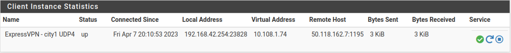
    * If you do not see this, you will have to refer to the related log entries.
5. <span style="color:yellow">**Do not forget to repeat the steps above for city2!**</span>
6. <br><span style="color:red">**Optional and unreliable -- Setup OpenVPN for NordVPN**</span>
7. <span style="color:red">First, you will have to reset nordvpn to use OpenVPN</span>
    * ```nordvpn set technology openvpn```
8. <span style="color:red">Next, you will have to connect to a few NordVPN hosts to get some server names in your area for OpenVPN. When it connects it will give you a name like us1234. the full hostname would be us1234.nordvpn.com</span>
9. <span style="color:red">Navigate to:**VPN > OpenVPN > Clients > Add**</span>
10. <span style="color:red">Enter the following data:</span>
    * <span style="color:red">**Description:** NordVPN-\<city1\></span>
    * <span style="color:red">**Server host or address:** Copy from your connection adventures in the format listed above.</span>
    * <span style="color:red">**Server port:** 1194</span>
    * <span style="color:red">**Username:** Your actual NordVPN login based on email.</span>
    * <span style="color:red">**Password:** Your actual NordVPN login password.</span>
    * <span style="color:red">**TLS Configuration:** Uncheck **Automatically generate a TLS Key.**</span>
    * <span style="color:red">**TLS Key:</span><br>
    ```
    -----BEGIN OpenVPN Static key V1-----
    e685bdaf659a25a200e2b9e39e51ff03
    0fc72cf1ce07232bd8b2be5e6c670143
    f51e937e670eee09d4f2ea5a6e4e6996
    5db852c275351b86fc4ca892d78ae002
    d6f70d029bd79c4d1c26cf14e9588033
    cf639f8a74809f29f72b9d58f9b8f5fe
    fc7938eade40e9fed6cb92184abb2cc1
    0eb1a296df243b251df0643d53724cdb
    5a92a1d6cb817804c4a9319b57d53be5
    80815bcfcb2df55018cc83fc43bc7ff8
    2d51f9b88364776ee9d12fc85cc7ea5b
    9741c4f598c485316db066d52db4540e
    212e1518a9bd4828219e24b20d88f598
    a196c9de96012090e333519ae18d3509
    9427e7b372d348d352dc4c85e18cd4b9
    3f8a56ddb2e64eb67adfc9b337157ff4
    -----END OpenVPN Static key V1-----
    ```
    * <span style="color:red">**Peer Certificate Authority:** NordVPN CA</span>
    * <span style="color:red">**Client Certificate:** None</span>
    * <span style="color:red">**Data Encryption Algorithms:** Allow **AES-256-CBC** and **AES-256-GCM**</span>
    * <span style="color:red">**Auth digest algorithm:** SHA512</span>
    * <span style="color:red">**Interval:** 1 -- Yes, one.</span>
    * <span style="color:red">**Custom options:** Maybe there are more stable ones?</span><br>
    ```
    tls-client;
    remote-random;
    tun-mtu 1500;
    tun-mtu-extra 32;
    mssfix 1450;
    persist-key;
    persist-tun;
    reneg-sec 0;
    remote-cert-tls server;
    ```
    * <span style="color:red">**Gateway creation:** IPv4 only</span>
    * <span style="color:red">**Verbosity level:** default</span>
        * <span style="color:red">This config should also work out of the box, if you have problems, bump this number up to 4.</span>
        * <span style="color:red">You can find the logs under **Status > System Logs > OpenVPN** or clicking the **Related log entries** icon in the top right.</span>
    * <span style="color:red">Save</span>
11. <span style="color:yellow">**Do not forget to repeat the steps above for city2!**</span>
12. <span sytle="color:yellow">**Do not forget to reset nordvpn back to nordlynx!**</span><br>
    ```nordvpn set technology nordlynx```<br>


## Service Watchdog
1. Navigate to:**Services > Service Watchdog**
2. Add both OpenVPN clients.
3. Add WireGuard.

## WireGuard Tunnel
1. Navigate to:**VPN > WireGuard > Add Tunnel**
2. Enter the following data:
    * **Description:** NordVPN - \<city1\>
    * **Listen Port:** 51820
    * **Interface Keys:** Copy the private key from ```wg showconf nordlynx```
    * Save Tunnel
3. Navigate to:**VPN > WireGuard > Peers > Add Peer**
4. Enter the following data:
    * **Tunnel:** tun_wg0
    * **Description:** NordVPN Peer
    * **Dynamic Endpoint:** Uncheck
    * **Endpoint**: Copy the endpoint IP address from either command (they're the same)
    * **Keep Alive:** 25
    * **Public Key:** Copy from ```wg showconf nordlynx```
    * **Allowed IPs:** 0.0.0.0/0 -- NordVPN Allowed IPs
    * Save Peer
5. Navigate to:**VPN > WireGuard > Settings**
6. Check **Enable WireGuard**
7. Save
8. Navigate to:**VPN > WireGuard Status**
    * You should see something like this:<br>
    
9. Take another snapshot of the pfSense virtual machine and label it: **VPN Config**

## Redirecting all WAN bound traffic through VPNs

### Create VPN Interfaces
1. Navigate to:**Interfaces > Interface Assignments**
2. Add both ExpressVPN tunnels and the NordVPN tunnel. -- **Make note of their names in relation to what tunnel they are!**
3. Save
4. Navigate to:**Interfaces > OPT1**
5. Enter the following data:
    * **Enable:** Check
    * **Description:** ExpressVPN-city1 or ExpressVPN-city2 or NordVPN-city1 depending on which you mapped first.
6. Save
7. **Repeat for all newly created OPT interfaces**
8. Apply Changes
9. You should see something like this:<br>
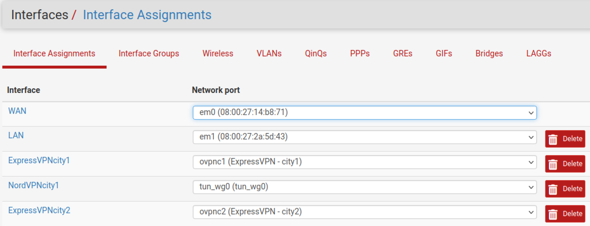
10. Now circle back to **NordVPNcity1**
11. Enter the following data:
    * **IPv4 Configuration Type** to **Static IPv4**
    * **IPv4 Address:** 10.5.0.2 / 29
12. Save

### Create Gateway for WireGuard
1. Navigate to:**System > Routing > Gateways**
2. Add
3. Enter the following data:
    * **Disabled:** Uncheck
    * **Interface:** NORDVPNCITY1
    * **Name:** NORDVPNCITY1
    * **Description:** Interface NORDVPNCITY1 Gateway
    * **Gateway:** 10.5.0.1
    * **Monitor IP:** 103.86.96.100 -- NordVPN.com
4. Save
5. Change **Default gateway IPv4** to WAN_DHCP or equivalent
6. Change **Default gateway IPv6** to WAN_DHCP6 or equivalent
7. Save
8. Apply Changes

### Edit Gateways for OpenVPN
1. Navigate to:**System > Routing > Gateways**
2. Edit **EXPRESSVPNCITY1**
3. Add Monitor IP: 208.67.222.222 -- ExpressVPN DNS VIP
4. Click **Display Advanced**
5. Update **Weight:** 2 -- ExpressVPN tunnels drop more packets by a large margin, so this will lean heavier on the WireGuard connection
6. Save
7. Edit **EXPRESSVPNCITY2**
8. Add Monitor IP: 208.67.220.220 -- ExpressVPN DNS VIP
9. Click **Display Advanced**
10. Update **Weight:** 2 -- ExpressVPN tunnels drop more packets by a large margin, so this will lean heavier on the WireGuard connection
11. Save
12. Apply Changes

### Test VPN Connectivity
1. Navigate to:**Diagnostics > Ping**
2. Enter the following data:
    * **Hostname:** google.com, a known ICMP responder.
    * **Source address:** Try each of your new gateways. EXPRESSCITY1 / EXPRESSCITY2 / NORDVPNCITY1
3. Click Ping
4. Repeat for All VPNs

### Create Gateway Group
1. Navigate to:**System > Routing > Gateways > Gateway Groups**
2. Add
3. Enter the following data:
    * **Group Name:** Outbound_VPN_Group
    * **WAN_DHCP or equivalent:** Tier 2
    * **NORDVPNCITY1:** Tier 1
    * **ExpressVPNCITY1_VP...:** Tier 1
    * **ExpressVPNCITY2_VP...:** Tier 1
    * **Trigger Level:** High Latency -- If we can get ExpressVPN openvpn connections drop less packets, then we can use more aggressive tactics.
    * **Description:** VPN Group with Comcast Failover
4. Save

### Update NAT Settings
1. Navigate to:**Firewall > NAT > Outbound**
2. Select **Manual Outbound NAT rule generation**
3. Save
4. Apply Changes
5. At the bottom of mappings click **Add to Top** we will be doing this for each VPN connection
6. Enter the following data:
    * **Interface:** EXPRESSVPNCITY1 / EXPRESSVPNCITY2 / NORDVPNCITY1
    * **Address Family:** IPv4
    * **Source:** 192.168.5.0/24
    * **Description:** Allow normal traffic to exit via VPN
7. Save
8. To speed up adding the next two, on the right next to the rule you just added under actions, click the copy icon and just change the **Interface!**
9. Apply Changes

### Update Firewall Rules
1. Navigate to:**Firewall > Rules > LAN**
2. Click **Edit icon** on the rule with the description: "Default allow LAN to any rule"
3. Click **Advanced Options**
4. Update **Gateway** to **Outbound_VPN_Group**
5. Save
6. Apply Changes

### Setup Load Balancing
1. Navigate to:**System > Advanced > Miscellaneous**
2. Enter the following data:
    * **Load Balancing:** Use sticky connections -- 360 seconds (adjust as needed later)
    * **Cryptographic Hardware:** AES-NI CPU-based Acceleration
3. Save
4. Navigate to:**Diagnostics > Reboot**
5. Submit

### Verify Default WAN Behavior
1. Navigate to:https://www.google.com -- **search:** what is my ip
    * If you already got flagged with a captcha, you don't even need to bother, you are on a VPN!
2. Compare the IP listed with your WAN IP, if it is different, it is using a VPN
3. Navigate to:**Status > Gateways**
4. You should see something like this:<br>
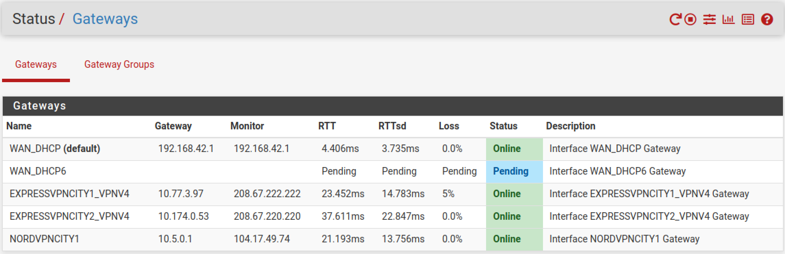
5. Click **Gateway Groups**
6. You should see something like this:<br>
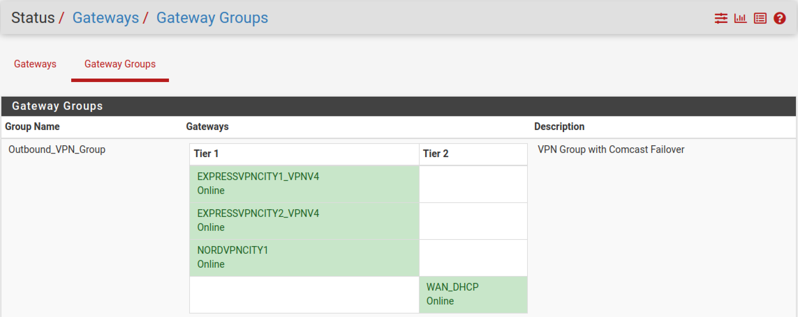

### Setup DNS and SSL/TLS Outgoing DNS Queries
1. Navigate to:**System > General Setup**
2. Add DNS servers for your VPN Connections
3. ExpressVPN uses: **208.67.220.220, 208.67.222.222** which is opendns.com
4. NordVPN **instead** will use: **1.1.1.1, 1.0.0.1** which is cloudflare-dns.com
5. WAN **instead** will use: **8.8.4.4** which is dns.google -- yes, dns.google.
6. Save
7. Navigate to:**Services > DNS Resolver**
8. Enter the following data:
    * **DNSSEC:** Disable
    * **DNS Query Forwarding**: Check **Use SSL/TLS for outgoing DNS Queries to Forwarding Servers**
9. Save
10. Apply Changes
11. Take another snapshot, label it: **VPN_WAN**

### Section Conclusion
* If your goal is to just have secure internet, you can stop here and skip forward to this section. However, if you want all the other bells and whistles used in IT Support, carry on!
* Even though when we setup openvpn we selected no hardware acceleration, that is a falsehood, it will use AES-NI as we specified in the config before we fisnished.

## Setup Bypass Proxy

* Are you tired of seeing this?<br>

* Below in this optional step I will poke a hole in your VPN setup to make life less frustrating.
1. On your Debian virtual machine you will want to login to the pfSense portal
2. Navigate to: **Diagnostics > Filer**
3. Add
4. Enter the following data:
    * **File:** /usr/local/www/proxy.pac
    * **Description:** VPN Bypass Proxy Config
    * **File Contents:**
    ```
    function FindProxyForURL(url, host) 
    { 
    
    //
    //If they only have a specified host name, go directly.
    //
    if (isPlainHostName(host))
        return "DIRECT"; 
    else if (shExpMatch(host, "*.google.com")) 
        return "PROXY 192.168.5.1:3128" ;
    else if (shExpMatch(host, "*.tidal.com")) 
        return "PROXY 192.168.5.1:3128" ;
    else if (shExpMatch(host, "*.amazon.com")) 
        return "PROXY 192.168.5.1:3128" ;
    else if (shExpMatch(host, "*.gstatic.com")) 
        return "PROXY 192.168.5.1:3128" ;
    else 
        return "DIRECT";
    }
    ```
5. Save
6. Repeat this process for **/usr/local/www/wpad.dat** and **/usr/local/www/wpad.da**
    * Symlinking would be lost when migrating to your production environment<br>
    
    * This file uses the subnet of the virtualhome.local network, you will want to update this to your production subnet later -- **Reasons for using ```sed```.**<br>

7. Navigate to: **System > Cert Manager**
8. Click: **Export CA** icon -- it should look like a sun.
9. Open that file in your favorite text editor
10. Navigate to: **Diagnostics > Filer**
11. Add
12. Enter the following data:
    * **File:** /usr/local/www/home.crt
    * **Description:** Home CA
    * **File Contents:** Paste the contents of the file you just opened previously in your text editor.
13. Save
    * This will give you a place to install the certificate on guest systems without risking your login credentials with guest devices.
14. Navigate to: **Services > Squid Proxy Server > Local Cache**
15. Save -- This step is required to setup the squid cache before starting the service.
16. Navigate to: **Services > Squid Proxy Server > Local General**
17. Enter the following data:
    * **Enable Squid Proxy:** Checked
    * **Outgoing Network Interface:** WAN
    * **Extra Trusted CA:** Home CA
    * **Enable Access Logging:** Checked
18. Navigate to: **Services > DHCP Server**
19. Expand **Additional BOOTP/DHCP Options**, click Add, 2 times.
20. Enter the following data (including the quotes): -- **Reasons for using ```sed``` intensify.**
    * **Option:** 252 -- String -- "http://192.168.5.1/wpad.dat"
    * **Option:** 252 -- String -- "http://192.168.5.1/wpad.da"
    * **Option:** 252 -- String -- "http://192.168.5.1/proxy.pac"
21. Save
22. In Firefox, press the **alt/option** key
23. Navigate to: **Edit > Settings > Search "cert" > View Certificates > Import**
24. There will be a dropdown in the bottom right, adjust that to: **Certificate Files**
25. Click Downloads
26. Import ```Home+CA.crt```
27. Check: **Trust this CA to identify websites.**
28. OK
29. OK
30. Cycle your network interface from the task manager.
31. Search "proxy"
32. Click: **Settings**
33. Click: **Auto-detect proxy settings for this network**
34. Open VirtualBox and navigate to pfSense virtual machine console window
35. Choose option **8**
36. ```tail -f /var/squid/logs/access.log```
37. Navigate back to Debian virtual machine and try loading: **https://tidal.com** -- Tidal disallows proxies
38. If the page loads, this is a good sign
39. Navigate back to the virtual machine running: ```tail -f /var/squid/logs/access```
    * You should see something like this:<br>
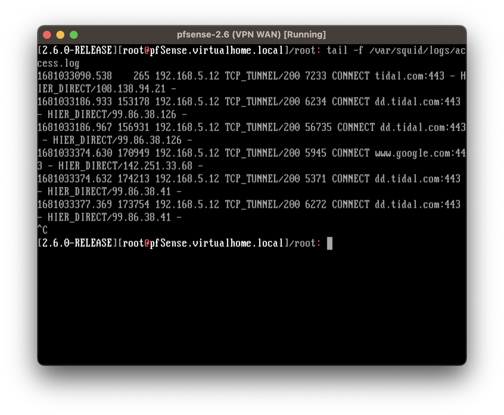
    * If you do, congratulations, less captchas!
    * You will have to edit these files time to time as you explore the internet behind VPNs. These settings will update for the entire network. You will have to add your CA cert to any device that you plan on using with this proxy service, once added you can update their network settings to use automatic proxy configuration!<br>

## Setup Static DHCP Entries to Force Gateways Per Host
* Maybe this proxy configuration doesn't work for you, maybe you just want to force certain devices to use VPN or WAN.
1. From the Debian virtual machine
2. Navigate to: **http://182.168.5.1** and login
3. Navigate to: **Status / DHCP Leases**
4. Find your device and click the light colored **plus** icon next to it
5. Enter the following data:
    * **IP Address:** An IP outside of your dynamic range set in **Services > DHCP Server**
    * **Hostname:** Choose something you can remember so you don't have to come back here
    * **Description:** If you do have to come back here, at least setup a description so you know what that host does!
6. Save
7. Apply Changes
8. Navigate to: **Firewall > Rules > LAN**
9. Add to top
10. Enter the following data:
    * **Source:** Single host or alias -- the IP you just made static
11. Under **Extra Options**, expand **Display Advanced**
12. Select the gateway you want from the dropdown near the bottom of the page.
13. Reset the networking on your target device

## Dial-in VPN Support
* I will setup an IPSEC tunnel for mobile login, however you can just as easily do it with **OpenVPN** as there is an export package available called **openvpn-client-export** to allow devices using OpenVPN to dial in without the fuss.
1. From the Debian virtual machine
2. Navigate to: **http://182.168.5.1** and login
3. Navigate to: **System > Users**
4. Add
5. Enter the following data:
    * **Username:** _You_
    * **Password:** _Your Password_
6. Save
7. Edit what you just created
8. Under **Effective Privileges** click **Add**
9. Select: **User - VPN: IPsec xauth Dialin**
10. Save
11. Navigate to: **Mobile Clients**
12. Enter the following data:
    * **Enable IPsec Mobile Client Support:** Check
    * **User Authentication:** Click **Local Database**
    * **Group Authentication:** Check
    * **Authentication Groups:** System Administrators, and User - VPN: IPsec with Dialin, if displayed
    * **Virtual Address Pool:** Check
      * 192.168.6.0 / 24 -- This may be desired to change later, if so ```sed?```
    * **Network List:** Check
    * **DNS Servers:** Check
      * **Server #1:** 192.168.5.1 -- ```sed!```
13. Save
14. Appply Changes
15. Create Phase 1
16. Enter the following data:
    * **Description:** VPN Server Phase 1
    * **Key Exchange version:** IKEv1 -- I've had problems using IKEv2, if you know better, let me know!
    * **Authentication Method:** Mutual PSK + Xauth
    * **Peer identifier:** Any
    * **NAT Traversal:** Force
17. Click **Generate new Pre-Shared Key** -- Copy this down!
18. Save
19. Apply Changes
20. Navigate to: **System > User Manager**
21. Edit the User you created
22. Scroll to the bottom and paste your new pre-shared key
23. Setup a client that is in your home network currently and attempt to connect to the current pfSense **WAN** IP.
24. Take another snapshot and label it: **VPN Options**

## Setup Virtual Container Server
* We can use the Debian virtual machine to setup containers locally and then spin up a new virtual machine to test iPXE later.

### Install Required Software
1. Navigate to the **Debian virtual machine**
2. Take a snapshot, label it: **Before docker**sudo 
3. Open a konsole / terminal
4. ```curl -fsSL https://get.docker.com -o get-docker.sh```
5. ```sudo sh ./get-docker.sh``` -- This will take a few minutes
6. ```sudo systemctl enable docker```
7. ```sudo systemctl start docker```
8. ```sudo usermod -aG docker $USER```
9. Reboot **Debian virtual machine**
10. Login and open another terminal<br>

    * This will be required to be run from your Synology NAS or any NAS that claims ownership of port 69 for tftp (even if it isn't running). You can skip this step if you are running it on a standalone system.<br>
11. ```docker volume create portainer_data```
12. ```docker run -d -p 8000:8000 -p 9443:9443 --name portainer --restart=always -v /usr/lib/systemd/system/docker.socket:/var/run/docker.sock -v portainer_data:/data portainer/portainer-ce:latest```<br>
13. You will have to create a macvlan network to force the next container to have its own dedicated IP without creating a port conflict.<br>
&nbsp;&nbsp;&nbsp;&nbsp;&nbsp;&nbsp;&nbsp;
    * **You can only have one instance of portainer running within your network, it will fail to connect if it detects it elsewhere, for some reason this still happens to me in virtualhome.local**
    * Chances are you do not need it in your virtual environment anyway.<br>

14. Navigate to: **https://localhost:9443**
15. accept the security risk.
16. Create an account
    * If it says it has timed out, run this: ```docker restart portainer```

17. ```mkdir -p docker-maps/netbootxyz/{config,assets}```
18. ```docker run -d -p 3000:3000 -p 69:69/udp -p 8080:80 --name netbootxyz --restart=always -v /home/$USER/docker-maps/assets -v /home/$USER/docker-maps/config ghcr.io/netbootxyz/netbootxyz```
19. Navigate to: **http://192.168.5.1**
20. Login
21. Navigate to: **Status > DHCP Leases**
22. Find your Debian virtual machine and click the light colored **plus** icon next to it
23. Enter the following data:
    * **IP Address:** 192.168.5.2**
    * **Hostname:** Choose something you can remember so you don't have to come back here
    * **Description:** If you do have to come back here, at least setup a description that way you know what that host does!
24. Save
25. Apply Changes
26. Restart the networking connection on your Debian virtual machine to update to the new address.
27. Navigate to: **http://localhost:3000**
28. If this page loads, as it should. You now have netboot.xyz installed!
29. Navigate to: **http://192.168.5.1**
30. Login
31. Navigate to: **Services > DHCP Server**
32. Expand advanced options under **TFTP**
33. Expand advanced options under **Network Booting**
34. Enter the following data:
    * **TFTP Server:** 192.168.5.2
    * **Default BIOS file name:** netboot.xyz.kpxe
    * **UEFI 32 bit file name:** netboot.xyz.efi
    * **UEFI 64 bit file name:** netboot.xyz.efi
35. Save
36. Navigate to **VirtualBox**
37. Create a new Virtual Machine
38. Label it: **PXE Test**
39. Expand: **Hard Disk**
40. Click: **Do Not Add a Virtual Hard Disk**
41. Finish
42. Edit the settings of your new virtual machine
43. Change type to **Other** and version to **Other/Unknown (64-bit)**
    * This is in hopes of allowing the boot of any type of opera
44. Click on the **System** tab and enable Network boot
45. Click on the **Network** tab update to use the **internal network,** select the **pfsense** network
46. Okay
47. Start
    * You should see the iPXE menu come up. If you do, you now have a basic netboot.xyz setup!

## 


## Import to Production Environment
* This section will show you how to take your config as it stands now and import it onto your hardware device.
1. Using the Debian virtual machine, navigate to: http://192.168.5.1
2. Navigate to: **Diagnostics > Backup & Restore**
3. Select: **Backup extra data**
4. Click: **Download configuration as XML**
5. Run: ```sudo cp $HOME/Downloads/config-pfSense* /mnt/shared/```
6. Navigate to:your production environment's pfSense address
7. Navigate to: **Diagnostics > Backup & Restore**
8. Browse to the location of your shared folder locally and select the configuration version
9. The firewall will reboot, come back to it in 10 minutes ideally for it to install everything and settle down.
    * Your IP scheme, hostname and Domain will need to be updated to what you prefer locally. This may be able to be updated in the configuration file via ```sed``` if you are ambitious. But it is unknown what impacts that will have on the rest of the services looking for IPs/Networks. Use the GUI.
10. Navigate to: **System > General Setup
11. Update your Hostname and Domain
12. Save
13. Navigate to: **Interfaces > LAN**
14. Update your IP Address
15. Save
16. Apply Changes