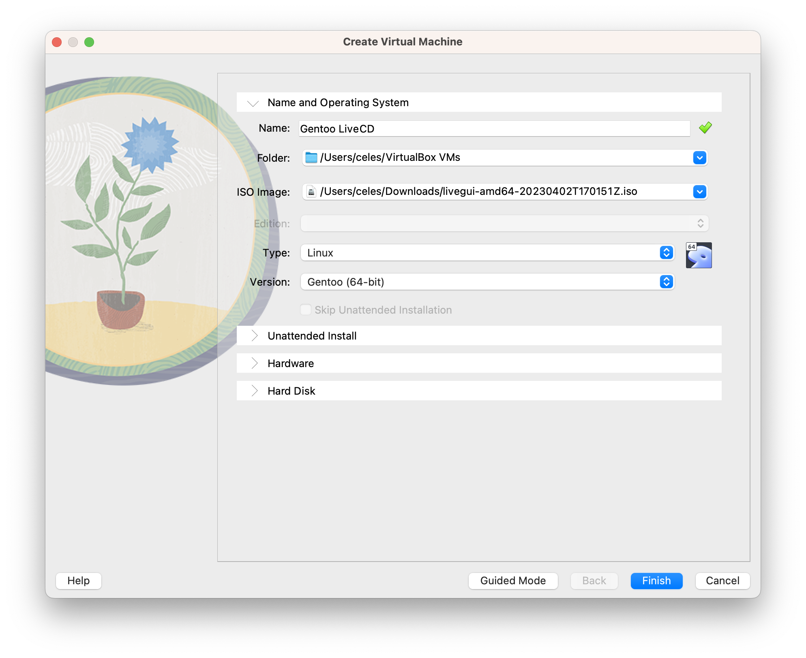
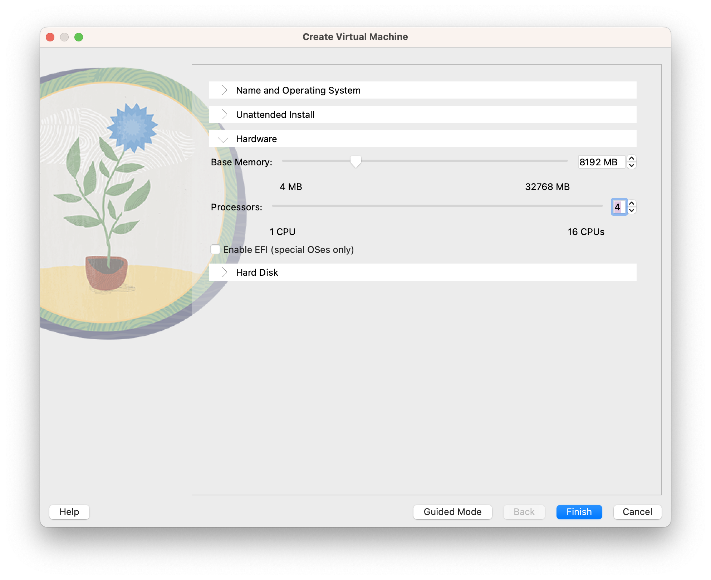
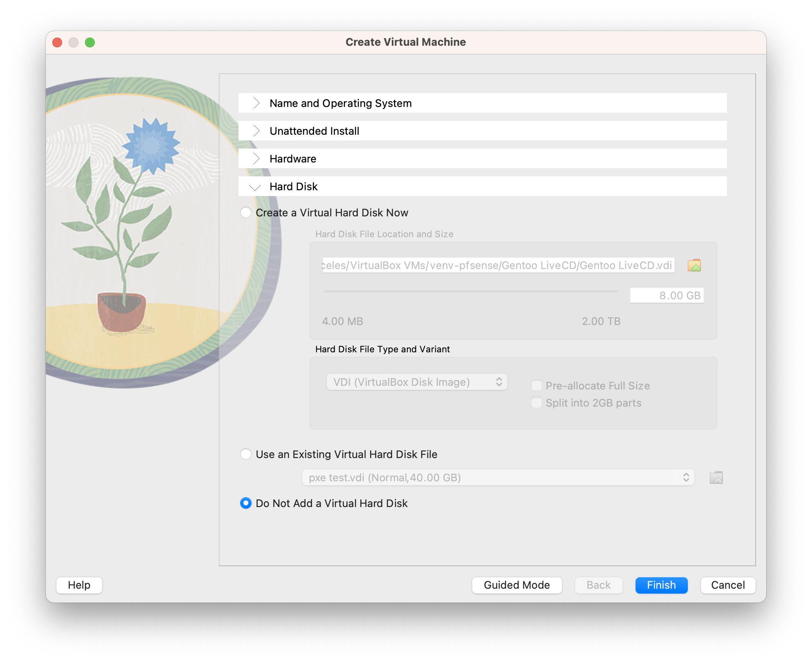

# pfsense-ultimate-config
This project contains the documentation on how to setup your pfSense firewall to route traffic through VPN providers and provide corporate features not found in home networks

## Table of Contents
1. [Features](#features)
2. [Requirements](#requirements)
3. [Before We Start](#before-we-start)
4. [Prepare the Virtual Environment](#prepare-the-virtual-environment)
5. [Install Virtual pfSense](#install-virtual-pfsense)
6. [Start Virtual Gentoo](#start-virtual-gentoo)

## Features
* Secure VPN:
  * VPN aggregation with WAN fail over.
  * OpenVPN with hardware acceleration.
  * Wireguard with hardware acceleration.
  * Details on how to connect to ExpressVPN and NordVPN.
  * Load Balancing.
  * Dedicated connections for media devices to bypass VPN.
  * VPN Passthrough for IKE/IPSEC/OpenVPN.
* Squid Proxy for site that do no like VPNs:
  * Includes instructions to setup a CA for HTTPS.
  * Includes wpad.dat / wpad.da / proxy.pac configuration via DHCP.
* Custom DHCP options:
  * PXE.
  * Custom NFSroot options for NFSv3/v4.1.
  * Automatic proxy configuration.
* Whitebox instructions for pcengines.ch devices:
  * Firmware Updates.
  * Performance Improvements.
* Containerized PXE boot with netboot.xyz:
  * Includes how to customaize windows PE to chainload Win10 and Win11 installs.
  * Includes how to create dynamic NFS root configurations via pfSense that iPXE reads from DHCP information.
  * Includes how to create custom dynamic netboot.xyz menus for iPXE.
* Network Analysis via Traffic Totals.
* TODO:
  * Containerized Network Analysis Reports.
  * Fix proxy configs.
  * Add drivers to WinPE for addition network card support.

## Requirements
* Hardware:
  * whitebox or netgate network appliance
    * I recommend pcengines apu2/3, personally I use an apu2c4 board.
    * If using an old desktop, a second 1gbe nic and labeling the MAC address on the outside so you know which NIC is which later.
* Software:
  * VirtualBox -- https://www.virtualbox.org/wiki/Downloads
  * Docker on a NAS or server, personally I use Synology with DSM 7.1 which already supports Docker as an add-on package.
  * pfSense -- https://www.pfsense.org/download/ -- AMD64 -- ISO
  * A LiveCD -- I recommend Gentoo and will be using it for my tutorials (Sorry, not sorry. It has everything we need for later.)
    * https://www.gentoo.org/downloads/ -- Click on "LiveGUI USB Image"
* Knowledge:
  * A general working understanding of IPV4, protocols and SSL. However, I will do my best to remove the mystery for the otherwise uninitiated.

## Before We Start
The process is to build up a virtual environment using your new configuration we build together so you don't break your internet connection unintentionally. You can use VMware Fusion/Workstation/ESXi or Microsoft HyperV, but I'm going with an open source platform agnostic solution here.<br><br>
I will need you to find a few things before we start.
1. Figure out if your internet provider's WAN configuration, if you don't know it is probably DHCP. Find the WAN MAC Address of your current router and write it down!

2. Be prepared for configuration corruption and using snapshots of your pfSense install as you tinker with it. Once we create a configuration you are happy with we can export it and apply it to your production environment.

## Prepare the Virtual Environment
1. Download your LiveCD and pfSense .iso files.
2. Install VirtualBox.
3. Unpack the pfsense.iso.gz file, I run a mac and the default archiver will not unpack it, use keke or the following command:
   *   ```gzip --decompress pfSense-CE-2.6.0-RELEASE-amd64.iso.gz```
3. Open VirtualBox.
4. Create a new Virtual Machine for pfSense. I emulate the settings of pcengines.ch APU2c4.


   1. Once created, right click on virtual machine and add it to a group so you do not get it confused with your other virtual machines!
   2. Select the virtual machine we just created and click **Settings > Network > Adapter 1**.
   3. Change the attached network to **Bridged Adapter**.
   4. Select the ethernet port that your computer is currently using to connect to your network.
   5. Click **Adapter 2 > Enable Network Adapter**.
   6. Change the attached network to **Internal Network**.
   7. Change the name to **pfSense**.
   8. You should be left with settings like these:


   9. Make note of the MAC addresses used by virtualbox otherwise you will not know which is which when setting up pfSense.
   10. Once updated, we will create the second virtual machine.
5. Create a new Virtual Machine for gentoo LiveCD, give it enough power that you don't 5 minutes waiting for it to boot, you're not using all those extra cores anyway [=:



   1. Select the virtual machine we just created and click **Settings > Network > Adapter 1**.
   2. Change the attached network to **Internal Network**.
   3. Change the name to **pfSense**.
   4. Save changes.

## Install Virtual pfSense
1. Start the pfsense virtual machine.
   * If you have a Retina display click **View > Virtual Screen 1 > Scale to 200%**.
2. Mash enter through the entire install.
3. Reboot the virtual machine.
   1. It will start the iso again, select from the menu above **Machine > ACPI Shutdown**.
   2. Open settings and navigate **Storage** then the CD icon under Storage Devices, on the right side of the menu click the CD icon again and select **Remove Disk from Virtual Drive**
   3. Restart the virtual machine.
   4. You shouldn't need luck yet to see this screen, if you do, quit now:<br>

   5. We configured the interfaces in the right order so we do not need to do anything here, however, when you build the actual device, you may have to reassign the interfaces.
   6. You may need to change the LAN network if your **WAN** also lists **192.168.1.x/24** to do that, select option **2** and follow the onscreen directions.

## Start Virtual Gentoo
1. We now leave the pfSense virtual machine on at all times and use the Gentoo LiveCD to edit and test the new configuration!
2. Start the Gentoo LiveCD.
   * If you have a Retina display click **View > Virtual Screen 1 > Scale to 200%**.
3. Right click on the desktop and select **Configure Display Settings** and boost your Resolution to something like 1440x900.
   * If this annoys you, think about how good it will be to ignore me once you have netboot.xyz setup so you can use whatever disto you like [=.
4. Open the installed browser **Falkon** and navigate to 192.168.1.1 (unless you had to change it above, however, I will be referring to it as 192.168.1.1 for the rest of this section).
5. Login to pfSense using the default login credentials: **admin / pfsense**